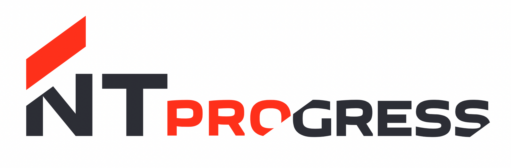

# Тестовое задание iOS (NTPro)



## 📈 Легенда

---

Привет. Поздравляем, ты пришёл на работу в компанию, которая разрабатывает систему по торговле валютой. Но вот незадача — у них нет мобильного приложения (кошмар!). Система ещё молодая, поэтому функций у неё немного. И тебя попросили создать приложение под iOS с основной функцией — просмотром сделок. 

## 🔮 **Что необходимо сделать**

---

Реализовать экран с таблицей сделок.

По умолчанию таблица должна быть отсортирована по дате изменения сделки.

Кроме того должна быть возможность сортировать таблицу по следующим полям: “имя инструмента”, “цена сделки”, “объем сделки” и “сторона сделки”.

Также необходимо уметь менять направление сортировки.

## 📦 **Что у тебя есть**

---

По [ссылке](https://bitbucket.org/ntprog/mobileiosdevtestwork/src/master/) лежит каркас приложения. Он содержит один экран с примером верстки ячейки со сделкой. Он призван сэкономить твое время, а так же показать, как реализуется подписка на получение сделок. Он реализован через storyboard, но это не значит, что ты должен следовать этому, можно делать кодом, на SwiftUI, в общем делать, как больше нравится.

Для этого в методе viewDidLoad вызывается следующий метод

```swift
server.subscribeToDeals { deals in
    self.model.append(contentsOf: deals)
    self.tableView.reloadData()
}
```

В callback этого метода приходит массив структур Deal.

```swift
struct Deal {
    let id: Int64 // Уникальный номер сделки
    let dateModifier: Date // Дата последнего изменения
    let instrumentName: String // Имя инструмента
    let price: Double // Цена сделки
    let amount: Double // Объем сделки
    let side: Side // Сторона сделки   

    enum Side: CaseIterable {
    case sell, buy
    }
}
```

После вызова метода `subscribeToDeals`, в callback асинхронно будут приходить пачки по 100 сделок. Они будут приходить до тех пор, пока не закончатся. Общее количество сделок - около одного миллиона.

## 🔨 **Требования по реализации**

---

- Цена сделки и объем сделки (поля price и amount) приходят в Double, цену надо округлить до сотых, а объем до целых.
- На экране должен быть интерфейс для того, чтобы сменить поле сортировки и направление сортировки.
- В зависимости от стороны сделки необходимо подкрашивать цену либо в красный - для sell, либо в зеленый для buy.
- При скроле списка он не должен тормозить.
- Проект должен быть выполнен в git-репозитории, на который необходимо предоставить ссылку.
- Делать изменения в классе Server нельзя. Необходимо строить решение, подразумевая, что в любой момент времени может прилететь новая пачка со сделками.